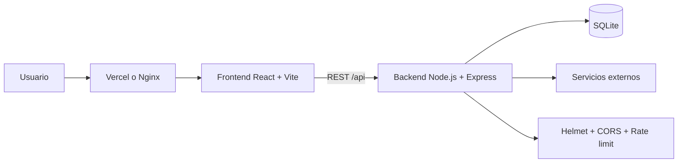

# Requerimientos Proyecto Desarrollo Web Integral
**ING 9° TI SEPT-DIC 2026**

El presente proyecto (`freightbd-dashboard`) es una aplicación web integral funcional, desarrollada en equipos de 3 - 4 personas, que cumple con los siguientes lineamientos de la materia:

## Arquitectura
* **Diagrama de arquitectura:** incluido abajo en Mermaid; puede exportarse como imagen para la entrega.
* **Justificación de la arquitectura:** Aplicación dividida en Frontend (React/Vite) y Backend (Node.js/Express) con base de datos SQLite. Se utilizan patrones como MVC/API REST para mantener la separación de responsabilidades, asegurando un sistema escalable y mantenible.

## Desarrollo
* **Frontend + Backend + Base de Datos:** Stack completo implementado.
* **API REST:** Desarrollo de una API REST propia en el directorio `/server`.
* **Integraciones:** Open-Meteo se consulta desde `server/weather.js` mediante `GET /api/weather` y muestra el clima de referencia en el dashboard para apoyar la planeación de fletes. Google Fonts también se usa como servicio externo de tipografías.

## Control de Versiones
* **Repositorio:** Alojado en GitHub/GitLab.
* **Historial:** Historial real de commits demostrando el progreso y colaboración del equipo.
* **Flujo de trabajo:** Uso activo de ramas (branches) y Pull Requests para la integración de código.
* **Instrucciones de ejecución:** Detalladas en la sección correspondiente de este README.

## Seguridad
* **Autenticación/Autorización:** Implementación de control de acceso para usuarios.
* **Contraseñas:** Hasheadas y protegidas (ej. usando bcrypt).
* **Validación de datos:** Prevención de inyecciones y validación de inputs tanto en el frontend como en el backend.
* **Variables de entorno:** Manejo de datos sensibles mediante archivos `.env` (no incluidos en el repositorio, ver `.env.example`).
* **HTTPS:** [Explicar cómo se implementaría con el proxy inverso de Nginx o certificados de Let's Encrypt en producción].

## Docker
* **Dockerfile:** `Dockerfile` funcional tanto para el frontend como para el backend.
* **Docker Compose:** Archivo `docker-compose.yml` configurado para levantar toda la aplicación (Frontend, Backend, Base de Datos y Nginx) con un solo comando.
* **Portabilidad:** El proyecto puede ser ejecutado en cualquier PC con Docker instalado sin necesidad de configurar componentes manualmente.

## Pruebas
* **Tipo de pruebas:** Prueba automatizada de generación y verificación de hashes en `server/test/generate-hash.test.js`.
* **Automatización:** `npm test` y `npm run build` se ejecutan en `.github/workflows/ci.yml` para cada push y Pull Request.
* **Evidencia:** ver `EVIDENCIAS.md` y completar el enlace de la ejecución de GitHub Actions.

## DevOps / Despliegue
* **CI/CD:** Pipeline básico implementado con GitHub Actions; tests y build se ejecutan automáticamente al hacer *push* o abrir un Pull Request.
* **Despliegue:** Aplicación desplegada en la nube a través de [Vercel / Render / AWS / etc.]. 
  * **Enlace de producción:** pendiente de completar en `EVIDENCIAS.md` después del despliegue en Vercel/Render.

## Documentación
* **Manual de instalación:** `README.md`.
* **Manual de usuario breve:** `MANUAL-USUARIO.md`.
* **Diagrama de arquitectura:** incluido abajo.
* **Evidencias:** `EVIDENCIAS.md`.

## Diagrama de arquitectura

## Estado de requisitos externos

El repositorio ya conserva historial real y remoto `origin/main`, pero la
entrega debe demostrar al menos una rama de trabajo y un Pull Request creados
por el equipo. El despliegue y sus URLs también deben registrarse en
`EVIDENCIAS.md`; no pueden generarse desde el código local.
