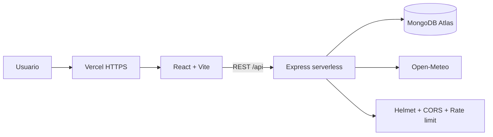

# Requerimientos del proyecto

**Proyecto Desarrollo Web Integral · ING 9° TI · Septiembre-Diciembre 2026**

## 1. Arquitectura

La aplicación separa la interfaz, la API y la persistencia:

- React/Vite entrega la interfaz web.
- Express implementa la API REST en funciones serverless de Vercel.
- MongoDB Atlas almacena clientes y fletes.
- Open-Meteo aporta el clima de referencia para apoyar la planeación.

Esta separación permite cambiar la interfaz, la API o la base de datos sin
mezclar responsabilidades. La API conserva el contrato REST y la capa de datos
concentra las operaciones de MongoDB.

## 2. Desarrollo

- Frontend: React, Vite y Tailwind CSS.
- Backend: Node.js y Express.
- Base de datos: MongoDB Atlas.
- API propia: autenticación, clientes, fletes, administración y clima.
- Servicio externo: Open-Meteo mediante `GET /api/weather`.

## 3. Control de versiones

El repositorio está en GitHub:

`https://github.com/Rappu10/freightbd-dashboard`

Existe historial real de commits y se utiliza la rama `main` para el despliegue.
La entrega debe adjuntar el enlace del Pull Request usado por el equipo y
conservar la evidencia de ramas y revisión en GitHub.

## 4. Seguridad

- Autenticación con contraseña y autorización mediante JWT.
- Contraseñas almacenadas como hashes bcrypt.
- Validación y saneamiento de entradas en Express Validator.
- Consultas MongoDB mediante el driver oficial, sin SQL construido por texto.
- Secretos mediante variables de entorno.
- Helmet, CORS y límites de peticiones.
- HTTPS automático de Vercel en producción.

## 5. Docker

El repositorio incluye Dockerfiles para frontend y backend y un
`docker-compose.yml`. El frontend y backend se levantan localmente con Docker;
MongoDB Atlas funciona como servicio administrado externo.

## 6. Pruebas

- Prueba automatizada: `server/test/generate-hash.test.js`.
- Comando: `npm test`.
- Build: `npm run build`.
- CI: `.github/workflows/ci.yml` ejecuta tests y build en push y Pull Request.
- Evidencia: [EVIDENCIAS.md](EVIDENCIAS.md).

## 7. Despliegue

Frontend y backend se despliegan juntos en Vercel:

`https://freightbd-dashboard.vercel.app/`

La API se verifica en:

`https://freightbd-dashboard.vercel.app/api/ping`

MongoDB Atlas es la base de datos persistente y no depende del almacenamiento de
Vercel.

## 8. Documentación

- Instalación y desarrollo: [README.md](README.md).
- Despliegue: [guia-despliegue-freightbd.md](guia-despliegue-freightbd.md).
- Usuario: [MANUAL-USUARIO.md](MANUAL-USUARIO.md).
- Evidencias: [EVIDENCIAS.md](EVIDENCIAS.md).
